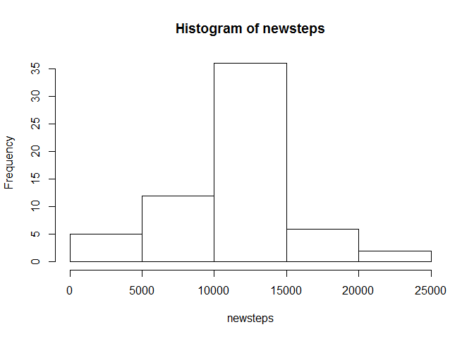

# Reproducible Research: Peer Assessment 1


#Loading and preprocessing the data

Clean the data to gain no. of steps for each day:


```r
data <- read.csv('activity.csv')
cleandata <- data[!is.na(data$step),]
steps <- sapply(unique(cleandata$date),function(a) sum(cleandata[cleandata$date==a,1]))
```


#What is mean total number of steps taken per day?
Make a histogram of the total number of steps taken each day


```r
hist(steps)
```

 


Calculate and report the mean and median total number of steps taken per day


```r
mean <- mean(steps)
median <- median(steps)
```

Therefore, the mean of total no. of steps per day is   : 1.0766189\times 10^{4}  
           the median of total no. of steps per day is : 10765  


#What is the average daily activity pattern?
Get the avg. no. of steps taken accross each 5-minute interval


```r
interval <- unique(cleandata$interval)
avgsteps <- sapply(interval, function(a) mean(cleandata[cleandata$interval == a,1]))
```

Make a time series plot of the 5-minute interval and the average number of steps taken, averaged across all days:


```r
plot(interval,avgsteps,type='l')
```

 

Therefore to get the 5-minute time interval with the maximum average no. of steps:


```r
bestinterval <- interval[which.max(avgsteps)]
```

Thus the 5-minute interval with the maximum average no. of steps is : 835-840 minutes interval.  


#Imputing missing values
Calculate and report the total number of missing values in the dataset:


```r
totalmissing <- nrow(data[is.na(data$step),])
```
           
Make a new dataset by filling the missing values with the floored average no. of steps in that 5-minute interval:


```r
newdata <- data
naindex <- which(is.na(data[,1]))
newdata[naindex,1] <-  sapply(naindex, function(a) as.integer(avgsteps[which(interval==data[a,3])]))
```

Make a histogram of the total number of steps taken each day using the new dataset:


```r
newsteps <- sapply(unique(newdata$date),function(a) sum(newdata[newdata$date==a,1]))
hist(newsteps)
```

 

calculating the mean and median of the new dataset for no. of steps per day:

```r
newmean <- mean(newsteps)
newmedian <- median(newsteps)
```

Therefore the new mean is   : 1.074977\times 10^{4}  
          the new median is : 10641  
          
Therefore it is evident that filling in the missing values has lowered the mean and the median.  


#Are there differences in activity patterns between weekdays and weekends?
Creating a new factor variable weekdays:


```r
newdata$weekday <- weekdays(strptime(newdata[,2],"%Y-%m-%d"))
newdata$weekday <- sapply(newdata$weekday, function(a) if(a == 'Sunday' || a == 'Saturday') {'weekend'} else{'weekday'})
newdata$weekday <- as.factor(newdata$weekday)
```

making a planel plot for weekend and weekdays:


```r
weekavgsteps <- sapply(interval, function(a) mean(newdata[newdata$interval == a & newdata$weekday == 'weekday',1]))
endavgsteps <- sapply(interval, function(a) mean(newdata[newdata$interval == a & newdata$weekday == 'weekend',1]))
par(mfrow=c(2,1))
plot(interval,endavgsteps,type="l",main="weekend" , ylab="no. of steps")
plot(interval,weekavgsteps,type="l",main="weekday" , ylab="no. of steps")
```

 
